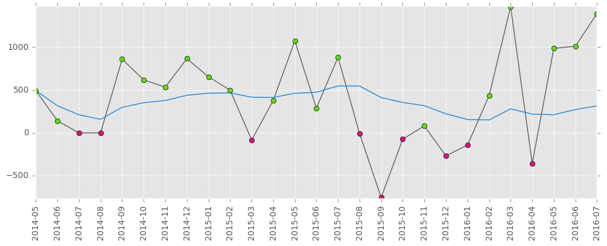
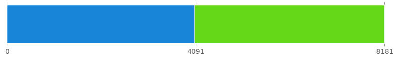
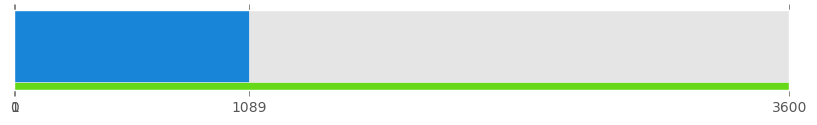

# fin


Track expenses, transactions or other values in plain text using python 3.

```
>>> from fin import Transactions
>>> expenses = Transactions("""
2016-06-30 food 10€
2016-07-01 spiders 2€
2016-07-01 food 5€
2016-07-01 rent 600€
2016-07-02 entertainment itunes tv(steven universe) 19,99€
2016-07-03 food(lemons) 6,42zł
""")
>>> food = expenses.filter('food and date >= 2016-07-01')
>>> print(food)
2016-07-01 food 5,00 €
2016-07-03 food(lemons) 6,42 zł
>>> print(food.sum())
6,42 zł + 5,00 €
>>> print(food.convert('€').sum())
6,46 €
```

## Installation

To install *fin* you need to manaully download repository and copy `fin` folder somewhere where python can reach it.

*Finanse* doesn't have any hard dependencies, and one optional, `matplotlib`, required if you want to use reporting with charts.

## Usage

Each transaction is described by single line:

```
2016-07-28      food(lemons)  ...    ...   shared        1000000€
↑               ↑                          ↑             ↑      ↑
date %Y-%m-%d   tag(with parameter)        another tag   amount currency or unit
```

### Create

List of transactions can be created from string:

```
expenses = Transactions("""
2016-06-30 food 10€
2016-07-01 spiders 2€
2016-07-01 food 5€
2016-07-01 rent 600€
2016-07-02 entertainment itunes tv(steven universe) 19,99€
2016-07-03 food(lemons) 6,42zł
""")
```


### Filter

Transactions can be filtered using predicate:
```
>>> print(expenses.filter(lambda t: 'spiders' in t.tags))
2016-07-01 spiders 2€
```

or using simple query language:

```
>>> print(expenses.filter('spiders'))
2016-07-01 spiders 2€
```

Full documentation of this language is in the [wiki](https://github.com/bevesce/fin/wiki#filter-query).

### Group

Transactions can be grouped by function that returns some key:

```
months = expenses.group(lambda t: t.date.strftime('%Y-%m'))
```

or by one of the keywords:

```
months = expenses.group('year-month')
```

```
>>> print(months)
2016-06:
2016-06-30 food 10,00 €

2016-07:
2016-07-01 spiders 2,00 €
2016-07-01 food 5,00 €
2016-07-01 rent 600,00 €
2016-07-02 entertainment itunes tv(steven universe) 19,99 €
2016-07-03 food(lemons) 6,42 zł
```

Full list of the keywords is in the [wiki](https://github.com/bevesce/fin/wiki#group-keywords).

### Sum

Summing transactions returns total amount of money:

```
>>> print(expenses.sum())
6,42 zł + 636,99 €
```

Grouped transactions can be summed too:

```
>>> print(months.sum())
2016-06: 10,00 €
2016-07: 6,42 zł + 626,99 €
```

### Convert

Money and transactions can be converted to another currency:

```
>>> print(expenses.sum().convert('$'))
709,52 $
>>> print(expenses.convert('$').sum())
710,85 $
```

The difference between the two is that standalone amount of money is converted using current conversion rate and transactions are converted using rate from its date. *Finanse* uses data provided by [fixer.io](http://fixer.io). Conversion rates are cached and you can make this cache permanent:

```
from fin import currency
currency.setup_cache(
    'path/to/where/this/should/be/stored/file.json'
)
```

Converting for other units is not supported right now.

### Report

`report` module provides some functions to plot charts. Hopefully, in the future, this collection will be comprehensive:

```
plot_months(
    path,
    transactions, in_currency,
    line_color, average_line_color,
    plus_marker_color=None, minus_marker_color=None
)
```



```
plot_split(
    path,
    left_transactions, right_transactions, in_currency,
    left_color, right_color
)
```



```
plot_progress(
    path,
    transactions, goal_transactions, in_currency,
    value_color, goal_color
)
```



## License

Copyright 2016 Piotr Wilczyński. Licensed under the MIT License.
